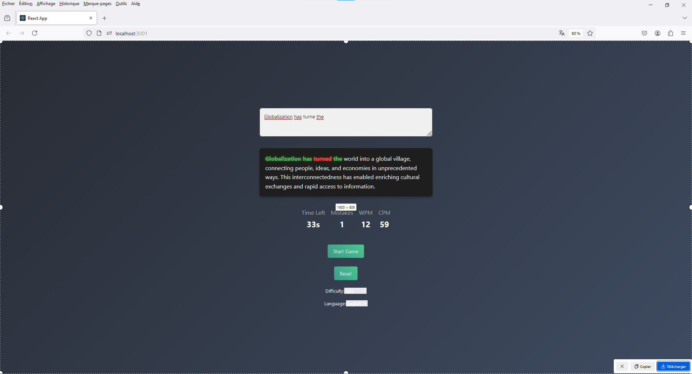

# Typing-Speed

Typing-Speed est une application React interactive conçue pour mesurer la vitesse de frappe au clavier des utilisateurs. Elle offre une expérience engageante et visuelle pour aider à améliorer la précision et la rapidité de la frappe.
## Screenshots


## Fonctionnalités

- **Test de vitesse de frappe en temps réel** : Tapez les mots affichés à l'écran et obtenez instantanément des statistiques telles que les mots par minute (WPM), les caractères par minute (CPM), et le nombre d'erreurs.
- **Feedback visuel** : Les mots correctement tapés apparaissent en vert, tandis que les erreurs apparaissent en rouge.
- **Effets animés** : Les animations apportent une touche moderne et dynamique à l'interface.
- **Statistiques complètes** : Suivez vos performances avec des statistiques détaillées à chaque session.
- **Interface utilisateur réactive et intuitive** : Conçue avec une esthétique épurée et des éléments interactifs.

## Installation

Pour exécuter l'application localement, suivez ces étapes :

1. Clonez le dépôt sur votre machine locale :

    ```bash
    git clone https://github.com/idrissziadi/Typing-Speed.git
    cd Typing-Speed
    ```

2. Installez les dépendances requises :

    ```bash
    npm install
    ```

3. Démarrez l'application :

    ```bash
    npm start
    ```

4. Ouvrez votre navigateur et visitez `http://localhost:3000` pour voir l'application en action.

## Utilisation

1. Cliquez sur le bouton "Démarrer le test" pour commencer à tester votre vitesse de frappe.
2. Commencez à taper les mots affichés dans le champ prévu à cet effet.
3. Surveillez vos statistiques en temps réel (mots par minute, caractères par minute, erreurs, etc.).
4. À la fin du test, une vue d'ensemble de vos statistiques vous sera présentée.

## Technologies Utilisées

- **React** : Bibliothèque JavaScript pour créer des interfaces utilisateur.
- **Material-UI** : Bibliothèque de composants UI pour React, utilisée pour le style de l'application.
- **CSS3** : Pour le style personnalisé et les animations.
- **JavaScript** : Logique de l'application.

## Contributions

Les contributions sont les bienvenues ! Si vous avez des idées d'amélioration, veuillez suivre ces étapes :

1. **Fork** le projet.
2. Créez votre **branche de fonctionnalité** (`git checkout -b feature/AmazingFeature`).
3. **Commitez** vos changements (`git commit -m 'Add some AmazingFeature'`).
4. **Poussez** vers la branche (`git push origin feature/AmazingFeature`).
5. **Ouvrez une Pull Request**.

## License

Distribué sous la licence MIT. Voir `LICENSE` pour plus d'informations.

## Contact


Lien du projet: [https://github.com/idriss.ziadi47@gmail.com/Typing-Speed](https://github.com/idrissziadi/Typing-Speed)
